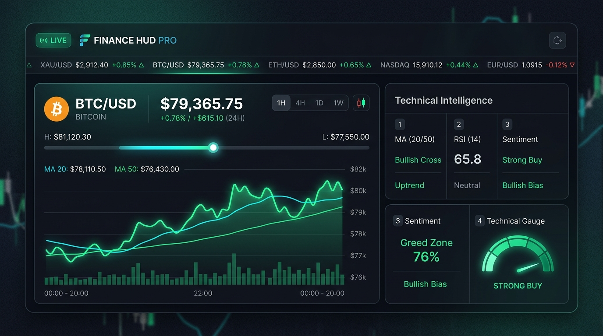

# 📈 Finance Terminal & Ticker HUD Pro

[](https://developer.chrome.com/docs/extensions/mv3/)
[](https://github.com)
[](https://github.com)
[](https://github.com)
[](https://github.com)

<p align="center">
  
</p>

A professional-grade, Bloomberg and TradingView-inspired financial terminal and live HUD built as a modern Chrome extension (Manifest V3) and standalone desktop workstation.

Track **Cryptocurrencies** (BTC, ETH, SOL), **Commodities & Precious Metals** (Gold Spot XAU/USD, Crude Oil), **Forex Pairs** (EUR/USD, USD/JPY, DXY), and **Major Indices** (S&P 500, Nasdaq QQQ) with live candlestick charting, technical indicator intelligence, continuous rolling ticker tape, smart browser toolbar badge, and an intuitive USD-first portfolio tracker.

---

## ✨ Key Features

### 1. 🖥️ Zero-Scroll Terminal View (580px Canvas)
- **Expanded Width (580px)**: Engineered to utilize maximum Chrome extension popup dimensions for a workstation experience without horizontal cramping.
- **Zero Vertical Scrolling**: The Hero Price, 24h High/Low range slider, interactive charting canvas, timeframe controls, and technical indicators are unified on a single screen—no scrolling required.
- **Dual Charting Engine**: Toggle between **Area Spline** and **OHLC Candlestick** visualizations with crosshair inspection tooltips across **1H, 24H, 7D, 1M, and 1Y** timeframes.

### 2. 🎞️ Continuous Rolling Prices Ticker Tape
- **Horizontal Market Marquee**: Smooth, unclipped 32px rolling ticker tape displaying live asset prices and color-coded 24h percentage changes.
- **Interactive Controls**: Hover to pause the tape; click any asset to instantly inspect it in the Terminal tab.
- **Real-Time Data Sync**: Automatically updates prices with smooth visual flash animations (green for bull upticks, red for pullbacks).

### 3. 🧠 Technical Intelligence & Gauge Suite
- **Moving Averages (MA 20 / 50)**: Live calculation with Golden Cross (bullish) and Death Cross (bearish) trend recognition.
- **RSI (14)**: Relative Strength Index oscillator tracking Overbought (>70), Oversold (<30), and Neutral momentum zones.
- **Market Sentiment**: Live Fear & Greed index integration (Extreme Fear, Fear, Neutral, Greed, Extreme Greed).
- **5-Segment Technical Gauge**: Composite multi-signal telemetry meter (`STRONG BUY`, `BUY`, `NEUTRAL`, `SELL`, `STRONG SELL`) with glowing visual segments.

### 4. 💼 Intuitive USD-First Portfolio Tracker
- **No Complex Math**: Simply enter how much you hold in USD right now (e.g., "$500 in Bitcoin" or "$2,500 in Gold").
- **Automatic Price Locking**: The engine automatically locks the current market entry price and computes exact coin/unit allocations.
- **Real-Time P&L & Donut Allocation**: Visual SVG donut chart showing portfolio distribution alongside live dollar and percentage return tracking over time.
- **Asset Management**: Edit holding amounts with ✏️ or delete tracked positions with 🗑️ at any time.

### 5. 🎯 Smart Browser Toolbar Badge
- **High-Precision Formatting**: Displays compact, readable price metrics on the extension icon:
  - `$79,365` displays as `79.1k` (not blindly rounded)
  - `$2,912` displays as `2.9k`
  - Values under $1,000 show exact digits (e.g., `455`, `104`)
- **Background Sync**: Updates via Chrome alarms and Service Workers even when the popup window is closed.
- **Configurable Mode**: Toggle between showing live price ($) or 24-hour percentage change (+/- %).

### 6. 🔔 Price Alerts with Synthesized Web Audio Chimes
- **Custom Thresholds**: Configure alerts for any asset crossing "Above" or "Below" a target price.
- **Web Audio Chimes**: Built-in harmonic synthesizer generates musical sound feedback upon triggers (ascending arpeggio for bullish breaks, descending chord for bearish dips).
- **Native Notifications**: Desktop notifications notify you immediately when alert conditions are met.

### 7. 💻 Full-Screen Workstation Mode (`dashboard.html`)
- Click the **Popout** button (⛶) to launch the dedicated, full-screen trading workstation for multi-monitor setups.
- Includes live simulated order book depth, extended technical intelligence, and multi-column market overview.

### 8. 🎨 4 Curated FinTech Themes
- **Obsidian**: Deep stealth dark mode with cyan and neon accents (Default).
- **Cyberpunk**: Ultra-vibrant neon palette with electric cyan and magenta highlights.
- **Midnight**: Classic institutional navy blue and gold financial terminal.
- **Crisp Light**: High-contrast, clean day mode with slate blue accents.

---

## 🚀 Installation Guide

### Install in Google Chrome / Brave / Microsoft Edge / Opera

1. **Clone or Download** this repository to your local machine:
   ```bash
   git clone https://github.com/jrcramos/finance_tracker.git
   ```
2. Open your browser and navigate to the Extensions management page:
   - **Google Chrome / Brave**: `chrome://extensions`
   - **Microsoft Edge**: `edge://extensions`
3. Enable **Developer mode** (toggle switch in the top-right corner).
4. Click the **"Load unpacked"** button in the top-left corner.
5. Select the `finance_tracker` directory.
6. Pin **Finance Terminal & Ticker HUD Pro** to your browser toolbar for quick access!

---

## 📂 Project Architecture

```
finance_tracker/
├── manifest.json       # Chrome Extension Manifest V3 configuration
├── background.js       # Background service worker (badge sync, alarms, notifications)
├── config.js           # Universal asset catalog, storage adapters, and API endpoints
├── popup.html          # Main 580px extension popup application
├── popup.js            # Reactive terminal controller, chart engine, audio synth, and state
├── terminal.css        # FinTech design system, themes, and zero-scroll layout
├── dashboard.html      # Full-screen multi-monitor workstation mode
├── icons/              # SVG and high-resolution extension icons
└── README.md           # Project documentation and guide
```

---

## 🌐 Supported Market Feeds

| Symbol | Asset Name | Market Type | Feed Provider |
|---|---|---|---|
| `BTC/USD` | Bitcoin | Cryptocurrency | Binance / CoinGecko |
| `ETH/USD` | Ethereum | Cryptocurrency | Binance / CoinGecko |
| `SOL/USD` | Solana | Cryptocurrency | Binance / CoinGecko |
| `XAU/USD` | Gold Spot | Precious Metal | Binance Pax Gold / Market Index |
| `WTI_OIL` | Crude Oil | Commodity | Yahoo Finance |
| `S&P 500` | S&P 500 Index | Equity Index | Yahoo Finance (`^GSPC`) |
| `Nasdaq` | Invesco QQQ | Tech Index | Yahoo Finance (`QQQ`) |
| `EUR/USD` | Euro Spot | Forex Currency | Binance / Market Index |
| `USD/JPY` | Japanese Yen | Forex Currency | Yahoo Finance (`JPY=X`) |
| `DXY` | US Dollar Index | Currency Index | Yahoo Finance (`DX-Y.NYB`) |
| *Custom* | User-defined | Any | Add custom symbols dynamically |

---

## 🔒 Privacy & Security

- **100% Client-Side**: No user data, holding amounts, or portfolio balances are sent to external analytics servers.
- **Direct Public API Calls**: Requests are made directly from your browser to public market endpoints (Binance, Yahoo Finance, Alternative.me).
- **Universal Local Storage**: Settings and portfolios are stored securely in Chrome local extension storage (`chrome.storage.local`) with complete JSON export/import backup capabilities.

---

## 📄 License

MIT License. Open source and free to customize for personal or commercial use.
